

  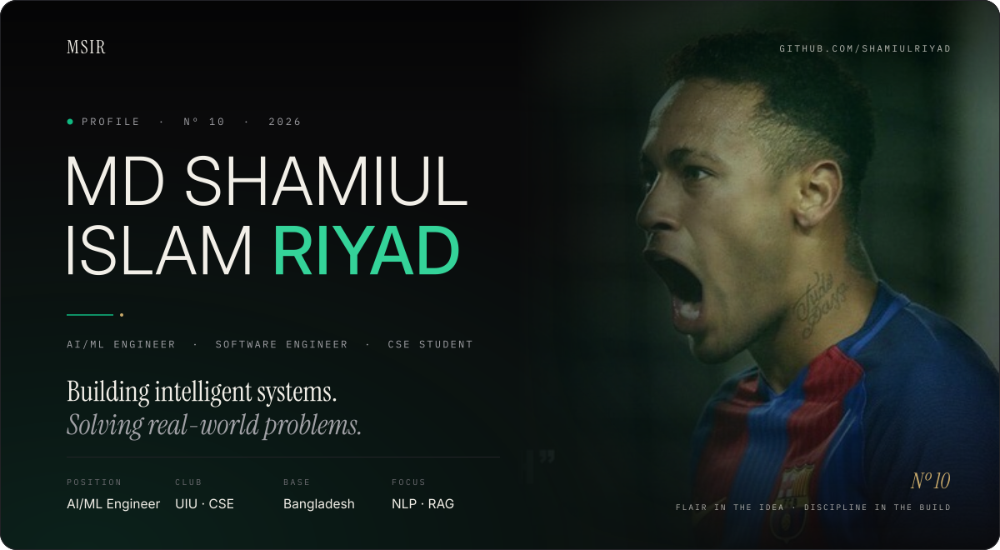

  
    <a href="#identity">IDENTITY</a> &nbsp;·&nbsp;
    <a href="#form">CURRENT FORM</a> &nbsp;·&nbsp;
    <a href="#work">SELECTED WORK</a> &nbsp;·&nbsp;
    <a href="#toolkit">TOOLKIT</a> &nbsp;·&nbsp;
    <a href="#achievements">ACHIEVEMENTS</a> &nbsp;·&nbsp;
    <a href="#performance">PERFORMANCE</a> &nbsp;·&nbsp;
    <a href="#connect">CONNECT</a>
  

 

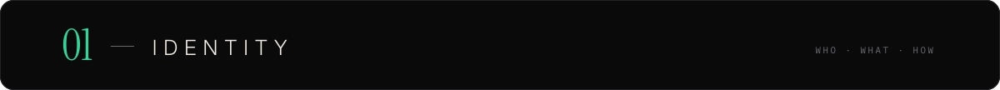

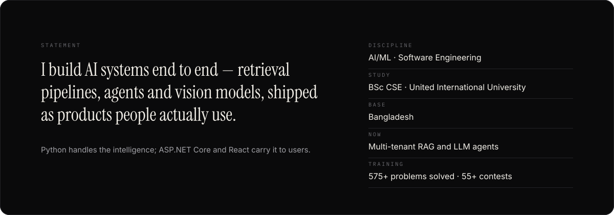

  

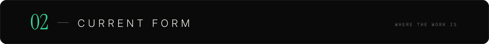

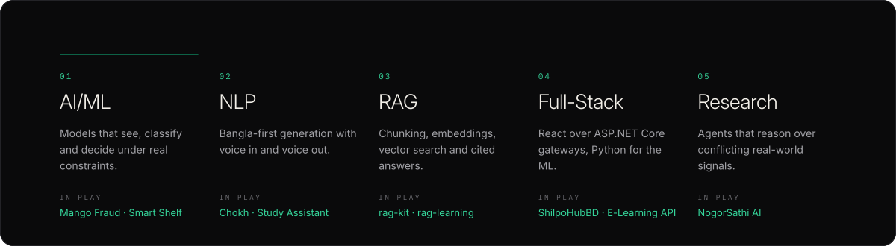

  

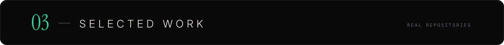

<table>
  <tr>
    <td width="50%" valign="top">
      <a href="https://github.com/shamiulriyad/rag-kit">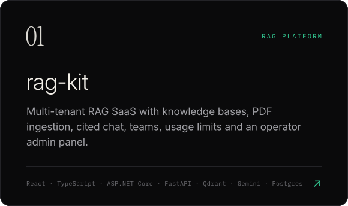</a>
       &nbsp;<a href="https://github.com/shamiulriyad/rag-kit">Repository ↗</a>
    </td>
    <td width="50%" valign="top">
      <a href="https://github.com/shamiulriyad/NogorSathi_UIU_GemmaHackathon">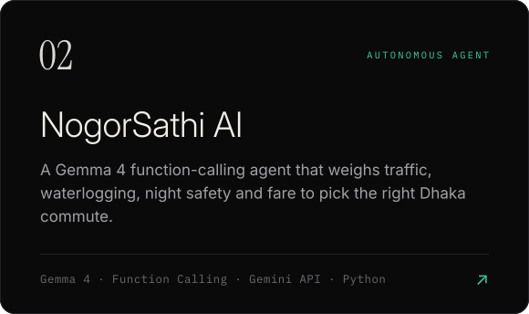</a>
       &nbsp;<a href="https://github.com/shamiulriyad/NogorSathi_UIU_GemmaHackathon">Repository ↗</a>
    </td>
  </tr>
  <tr>
    <td width="50%" valign="top">
      <a href="https://github.com/shamiulriyad/Ml-bangladesh-hackthon">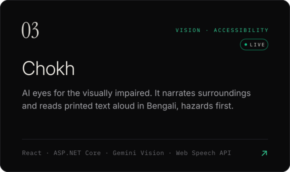</a>
       &nbsp;<a href="https://github.com/shamiulriyad/Ml-bangladesh-hackthon">Repository ↗</a> &nbsp;·&nbsp; <a href="https://ml-bangladesh-hackthon-1.onrender.com/">Live demo ↗</a>
    </td>
    <td width="50%" valign="top">
      <a href="https://github.com/shamiulriyad/mango-fraud-detection-system">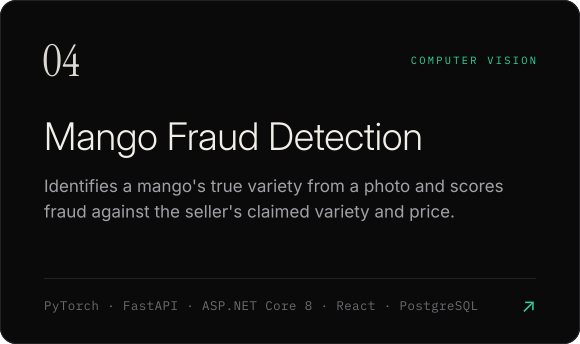</a>
       &nbsp;<a href="https://github.com/shamiulriyad/mango-fraud-detection-system">Repository ↗</a>
    </td>
  </tr>
  <tr>
    <td width="50%" valign="top">
      <a href="https://github.com/shamiulriyad/rag-learning">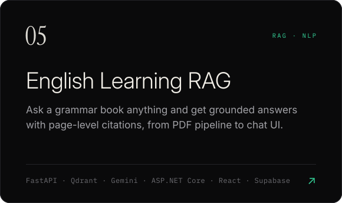</a>
       &nbsp;<a href="https://github.com/shamiulriyad/rag-learning">Repository ↗</a>
    </td>
    <td width="50%" valign="top">
      <a href="https://github.com/shamiulriyad/ShilpoHubBD">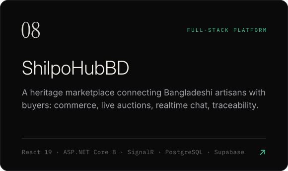</a>
       &nbsp;<a href="https://github.com/shamiulriyad/ShilpoHubBD">Repository ↗</a>
    </td>
  </tr>
</table>

  ALSO ON THE PITCH &nbsp;—&nbsp;
  <a href="https://github.com/shamiulriyad/AI-Study-Assistant">AI Study Assistant</a> &nbsp;·&nbsp;
  <a href="https://github.com/shamiulriyad/smart-shelf-autonomous-robot">Smart Shelf Robot</a> &nbsp;·&nbsp;
  <a href="https://github.com/shamiulriyad/Techathon_TheLastDance">Smart Office Monitor</a> &nbsp;·&nbsp;
  <a href="https://github.com/shamiulriyad/DatabaseHub">E-Learning API</a>

 

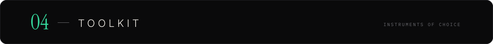

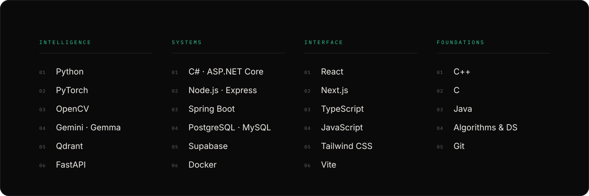

  

<table>
  <tr>
    <td width="50%"><a href="https://github.com/shamiulriyad/NogorSathi_UIU_GemmaHackathon">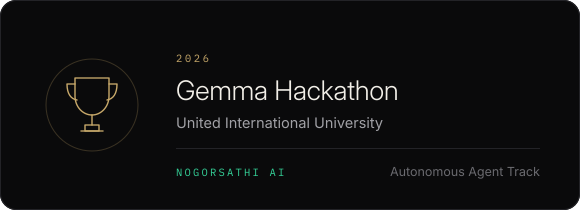</a></td>
    <td width="50%"><a href="https://github.com/shamiulriyad/ICT_Fest_Hackathon_Preliminary">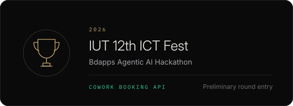</a></td>
  </tr>
  <tr>
    <td width="50%"><a href="https://github.com/shamiulriyad/Techathon_TheLastDance">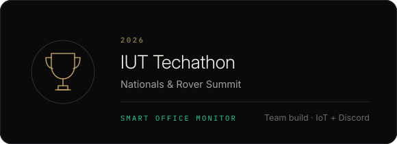</a></td>
    <td width="50%"><a href="https://github.com/shamiulriyad/Ml-bangladesh-hackthon">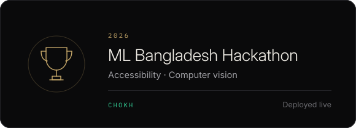</a></td>
  </tr>
</table>

  CERTIFIED &nbsp;—&nbsp;
  <a href="https://www.hackerrank.com/certificates/e03379cd4242">HackerRank ↗</a> &nbsp;·&nbsp;
  <a href="https://simpli-web.app.link/e/mYkOfC4lnYb">Database ↗</a> &nbsp;·&nbsp;
  <a href="https://github.com/shamiulriyad/geeksforgeeks-challenge-365-Days">GeeksforGeeks 365-day challenge ↗</a>

 

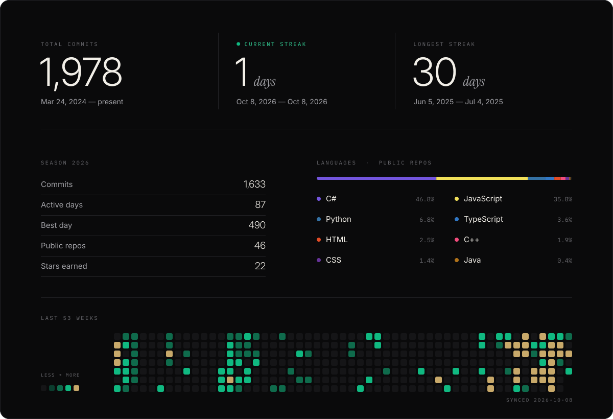

  

  <a href="https://github.com/shamiulriyad">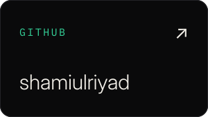</a>
  <a href="https://www.linkedin.com/in/md-shamiul-islam-riyad-31b8352b4/">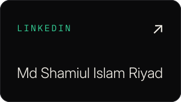</a>
  <a href="https://codeforces.com/profile/Riyad_shamiul">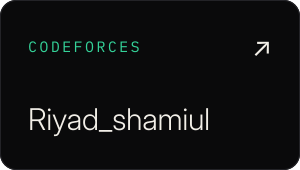</a>
  <a href="https://leetcode.com/u/shamiulislamriyad/">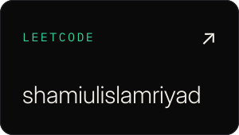</a>
  <a href="https://www.youtube.com/@ZeroTo420perfect">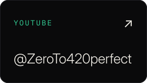</a>

<a href="https://riyadsn.vercel.app/">riyadsn.vercel.app</a>

