

  

  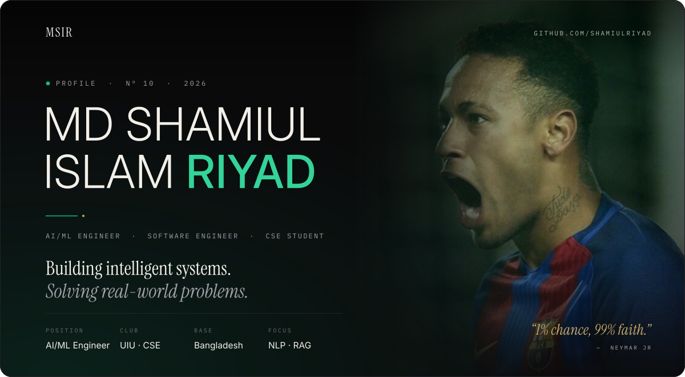

  
    <a href="#identity">IDENTITY</a> &nbsp;·&nbsp;
    <a href="#form">CURRENT FORM</a> &nbsp;·&nbsp;
    <a href="#work">SELECTED WORK</a> &nbsp;·&nbsp;
    <a href="#toolkit">TOOLKIT</a> &nbsp;·&nbsp;
    <a href="#achievements">ACHIEVEMENTS</a> &nbsp;·&nbsp;
    <a href="#performance">PERFORMANCE</a> &nbsp;·&nbsp;
    <a href="#connect">CONNECT</a>
  

 

  

  

<table>
  <tr>
    <td width="50%" valign="top">
      
       &nbsp;<a href="https://github.com/shamiulriyad/rag-kit">Repository ↗</a>
    </td>
    <td width="50%" valign="top">
      
       &nbsp;<a href="https://github.com/shamiulriyad/NogorSathi_UIU_GemmaHackathon">Repository ↗</a>
    </td>
  </tr>
  <tr>
    <td width="50%" valign="top">
      
       &nbsp;<a href="https://github.com/shamiulriyad/Ml-bangladesh-hackthon">Repository ↗</a> &nbsp;·&nbsp; <a href="https://ml-bangladesh-hackthon-1.onrender.com/">Live demo ↗</a>
    </td>
    <td width="50%" valign="top">
      <a href="https://github.com/shamiulriyad/lsh26-t035-p12">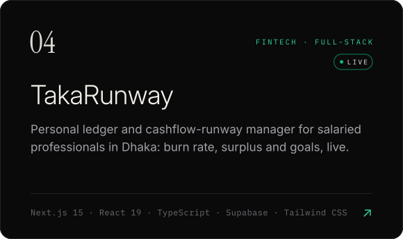</a>
       &nbsp;<a href="https://github.com/shamiulriyad/lsh26-t035-p12">Repository ↗</a> &nbsp;·&nbsp; <a href="https://lsh26-t035-p12.onrender.com">Live demo ↗</a>
    </td>
  </tr>
  <tr>
    <td width="50%" valign="top">
      
       &nbsp;<a href="https://github.com/shamiulriyad/mango-fraud-detection-system">Repository ↗</a>
    </td>
    <td width="50%" valign="top">
      <a href="https://github.com/shamiulriyad/sust_preli">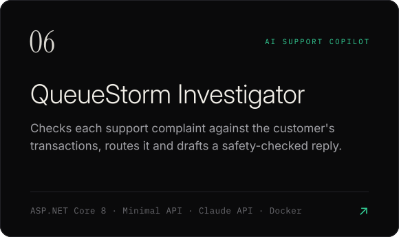</a>
       &nbsp;<a href="https://github.com/shamiulriyad/sust_preli">Repository ↗</a>
    </td>
  </tr>
  <tr>
    <td width="50%" valign="top">
      
       &nbsp;<a href="https://github.com/shamiulriyad/rag-learning">Repository ↗</a>
    </td>
    <td width="50%" valign="top">
      
       &nbsp;<a href="https://github.com/shamiulriyad/ShilpoHubBD">Repository ↗</a>
    </td>
  </tr>
</table>

| | Project | What it is | Stack |
|:--|:--|:--|:--|
| `01` | [**AI Study Assistant**](https://github.com/shamiulriyad/AI-Study-Assistant) | Ask by text or voice and get a simple Bangla answer, read aloud | React · .NET 8 · Gemini |
| `02` | [**LoadShed Planner**](https://github.com/shamiulriyad/lsh26-t035-p01) | LSH26 build: schedules a print shop's jobs around rotating power cuts | Spring Boot · Java · JavaScript · Docker |
| `03` | [**Nurture-Glow**](https://github.com/shamiulriyad/Nurture-Glow) | Team platform for mothers, pregnancy and baby care, with a local RAG assistant | React · Express · MySQL · Qdrant |
| `04` | [**Smart Shelf Robot**](https://github.com/shamiulriyad/smart-shelf-autonomous-robot) | Vision-guided pick-and-place prototype with ArUco markers and A* planning | Python · OpenCV |
| `05` | [**Smart Office Monitor**](https://github.com/shamiulriyad/Techathon_TheLastDance) | IUT Techathon: simulated IoT office with a live 3D dashboard and a Discord bot | Node.js · Socket.IO · React · SQLite |
| `06` | [**CoWork Booking API**](https://github.com/shamiulriyad/ICT_Fest_Hackathon_Preliminary) | IUT ICT Fest agentic AI hackathon: multi-tenant booking API, bugs fixed to contract | FastAPI · SQLAlchemy · JWT |
| `07` | [**QueueStorm Ticket Sorter**](https://github.com/shamiulriyad/sust_hacathon) | bKash SUST mock round: rules-based Bangla and English ticket classifier | ASP.NET Core 8 |
| `08` | [**Doctor MCP Server**](https://github.com/shamiulriyad/make-my-mcp-server) | MCP server foundation for doctor scheduling over an existing MySQL database | Node.js · Express · MySQL |
| `09` | [**E-Learning API**](https://github.com/shamiulriyad/DatabaseHub) | Courses, assessments, payments and gamification behind a REST API | ASP.NET Core · PostgreSQL |
| `10` | [**learnEnglish & web builds**](https://github.com/shamiulriyad/web-Project) | AI grammar-learning platform plus FreshBox, Startup and coding-platform builds | React · ASP.NET Core · OpenAI |
| `11` | [**Flappy Bird**](https://github.com/shamiulriyad/lag-legend) | A Java Swing clone of Flappy Bird | Java · Swing |
| `12` | [**AI Algorithms**](https://github.com/shamiulriyad/AI-ML) | Constraint satisfaction and A* search, implemented from scratch | Python |
| `13` | [**Portfolio**](https://riyadsn.vercel.app/) | Personal portfolio site (live, private repo) | React · .NET · Supabase |

  <a href="https://github.com/shamiulriyad/leetcode">LeetCode</a> &nbsp;·&nbsp;
  <a href="https://github.com/shamiulriyad/codeforces">Codeforces</a> &nbsp;·&nbsp;
  <a href="https://github.com/shamiulriyad/codechef">CodeChef</a> &nbsp;·&nbsp;
  <a href="https://github.com/shamiulriyad/UVa">UVa</a> &nbsp;·&nbsp;
  <a href="https://github.com/shamiulriyad/geeksforgeeks-challenge-365-Days">GeeksforGeeks 365</a> &nbsp;·&nbsp;
  <a href="https://github.com/shamiulriyad/dsa-interviewbit">InterviewBit</a> &nbsp;·&nbsp;
  <a href="https://github.com/shamiulriyad/Hackerrank-challenge">HackerRank</a> &nbsp;·&nbsp;
  <a href="https://github.com/shamiulriyad/HackerEarthBattleGround-">HackerEarth</a> &nbsp;·&nbsp;
  <a href="https://github.com/shamiulriyad/CodeWarsOfRiyad">CodeWars</a> &nbsp;·&nbsp;
  <a href="https://github.com/shamiulriyad/data-structures-and-algorithms">DSA</a> &nbsp;·&nbsp;
  <a href="https://github.com/shamiulriyad/Algomaster-Master-DSA-Patterns">DSA Patterns</a> &nbsp;·&nbsp;
  <a href="https://github.com/shamiulriyad/sql-exercises-and-solutions">SQL</a> &nbsp;·&nbsp;
  <a href="https://github.com/shamiulriyad/Java">Java OOP</a> &nbsp;·&nbsp;
  <a href="https://github.com/shamiulriyad/Recursion-and-Function">Recursion</a> &nbsp;·&nbsp;
  <a href="https://github.com/shamiulriyad/string_basic_and_problem_solve">Strings</a> &nbsp;·&nbsp;
  <a href="https://github.com/shamiulriyad/C_Programming">C Programming</a> &nbsp;·&nbsp;
  <a href="https://github.com/shamiulriyad/basic-c-learn-full">C Basics</a> &nbsp;·&nbsp;
  <a href="https://github.com/shamiulriyad/pattern-problem-in-c">Patterns</a> &nbsp;·&nbsp;
  <a href="https://github.com/shamiulriyad/array-in-c">Arrays</a> &nbsp;·&nbsp;
  <a href="https://github.com/shamiulriyad/nested-loop-in-c">Nested Loops</a> &nbsp;·&nbsp;
  <a href="https://github.com/shamiulriyad/beecrowd-problem-solve-series">beecrowd</a> &nbsp;·&nbsp;
  <a href="https://github.com/shamiulriyad/problem-solve-2">Problem Solving</a> &nbsp;·&nbsp;
  <a href="https://github.com/shamiulriyad/React_start">React + Zustand</a>

 

  

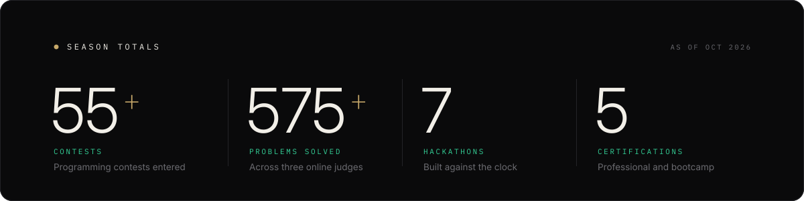

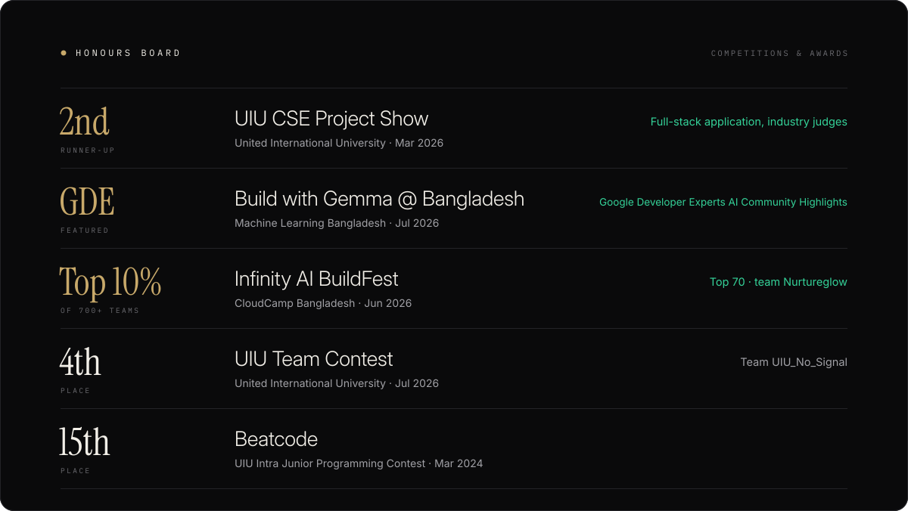

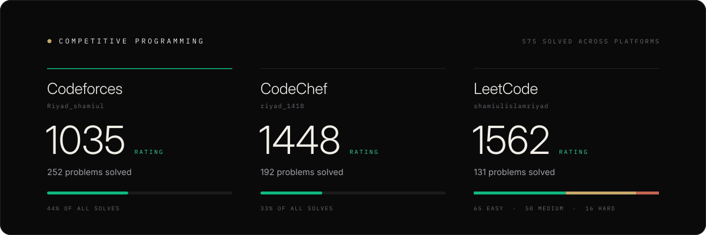

  <a href="https://codeforces.com/profile/Riyad_shamiul">Codeforces ↗</a> &nbsp;·&nbsp;
  <a href="https://www.codechef.com/users/riyad_1418">CodeChef ↗</a> &nbsp;·&nbsp;
  <a href="https://leetcode.com/u/shamiulislamriyad/">LeetCode ↗</a>

<table>
  <tr>
    <td width="50%"></td>
    <td width="50%"><a href="https://github.com/shamiulriyad/Nurture-Glow">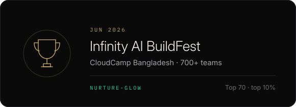</a></td>
  </tr>
  <tr>
    <td width="50%"><a href="https://github.com/shamiulriyad/lsh26-t035-p12">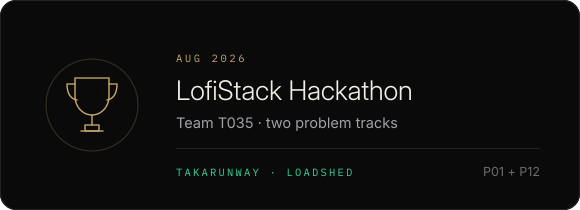</a></td>
    <td width="50%"></td>
  </tr>
  <tr>
    <td width="50%"><a href="https://github.com/shamiulriyad/sust_preli">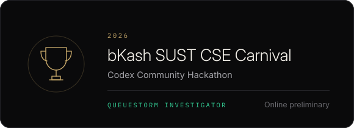</a></td>
    <td width="50%"></td>
  </tr>
  <tr>
    <td width="50%"></td>
    <td width="50%">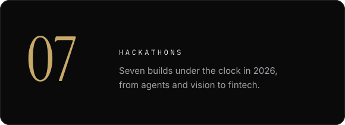</td>
  </tr>
</table>

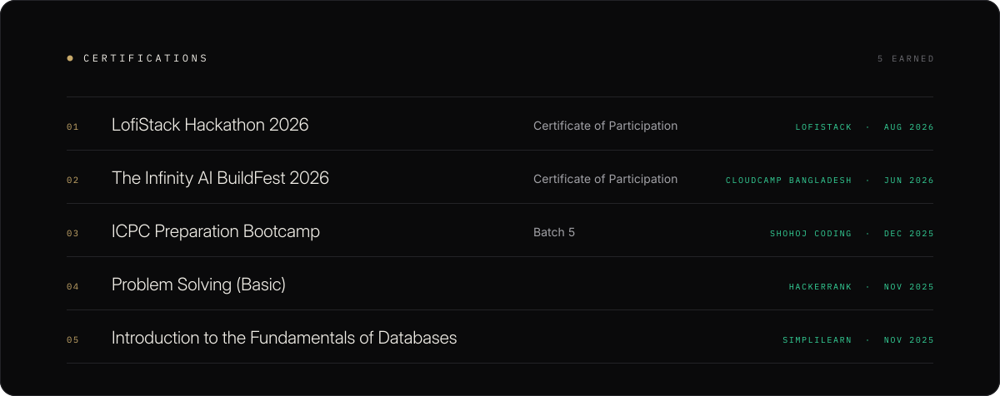

  VERIFY &nbsp;—&nbsp;
  <a href="https://www.hackerrank.com/certificates/e03379cd4242">HackerRank ↗</a> &nbsp;·&nbsp;
  <a href="https://simpli-web.app.link/e/mYkOfC4lnYb">Simplilearn ↗</a>

 

  

  
  
  <a href="https://x.com/sami46982396523">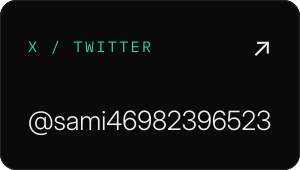</a>
  
  <a href="https://riyadsn.vercel.app/">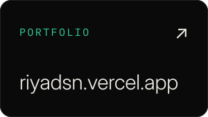</a>

  
  
  <a href="https://www.codechef.com/users/riyad_1418">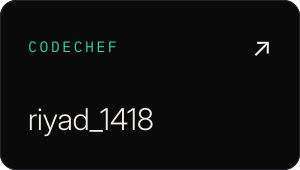</a>
  
  <a href="https://www.hackerrank.com/profile/shamiulriyad96">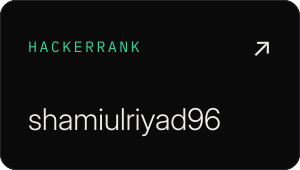</a>

