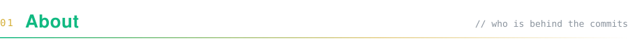
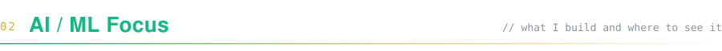
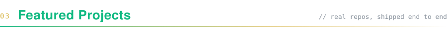
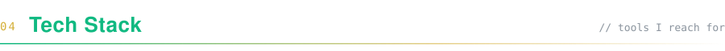
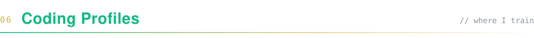

<!-- ───────────────────────────── HERO ───────────────────────────── -->
<table align="center">
  <tr>
    <td valign="middle" width="62%">
      
    </td>
    <td valign="middle" align="center" width="38%">
       
       
      
    </td>
  </tr>
</table>

  
  
  

 

<!-- ───────────────────────────── 01 ABOUT ───────────────────────────── -->

I'm a CSE student who builds AI systems the full way through: the model or retrieval pipeline, the API around it, and the interface people actually use. Most of what I make ends up as a React front end over an ASP.NET Core gateway, with Python handling the ML.

<table>
  <tr>
    <td width="33%" valign="top"><b><code>NOW</code></b> Multi-tenant RAG infrastructure and LLM agents with real tool calling</td>
    <td width="33%" valign="top"><b><code>APPROACH</code></b> Ground every answer, keep secrets server-side, ship a working demo</td>
    <td width="33%" valign="top"><b><code>OFF-SCREEN</code></b> Daily DSA in C++, hackathons, and watching Neymar play</td>
  </tr>
</table>

<!-- ───────────────────────────── 02 FOCUS ───────────────────────────── -->

<table>
  <tr>
    <th align="left" width="22%">Area</th>
    <th align="left">What I work on</th>
    <th align="left" width="32%">See it in</th>
  </tr>
  <tr>
    <td><b>RAG</b></td>
    <td>Extraction, chunking, embeddings, vector search and answers with citations</td>
    <td><a href="https://github.com/shamiulriyad/rag-kit">rag-kit</a> · <a href="https://github.com/shamiulriyad/rag-learning">rag-learning</a></td>
  </tr>
  <tr>
    <td><b>LLM Agents</b></td>
    <td>Function-calling tool loops that weigh conflicting signals before recommending something</td>
    <td><a href="https://github.com/shamiulriyad/NogorSathi_UIU_GemmaHackathon">NogorSathi AI</a></td>
  </tr>
  <tr>
    <td><b>NLP</b></td>
    <td>Generation in Bangla first, plus voice input and output</td>
    <td><a href="https://github.com/shamiulriyad/AI-Study-Assistant">AI Study Assistant</a> · <a href="https://github.com/shamiulriyad/Ml-bangladesh-hackthon">Chokh</a></td>
  </tr>
  <tr>
    <td><b>Computer Vision</b></td>
    <td>Image classification, scene narration and marker-based pose estimation</td>
    <td><a href="https://github.com/shamiulriyad/mango-fraud-detection-system">Mango Fraud</a> · <a href="https://github.com/shamiulriyad/smart-shelf-autonomous-robot">Smart Shelf</a></td>
  </tr>
  <tr>
    <td><b>Software Eng.</b></td>
    <td>Clean Architecture APIs, JWT auth, realtime features and relational data modelling</td>
    <td><a href="https://github.com/shamiulriyad/ShilpoHubBD">ShilpoHubBD</a> · <a href="https://github.com/shamiulriyad/DatabaseHub">DatabaseHub</a></td>
  </tr>
</table>

<!-- ───────────────────────────── 03 PROJECTS ───────────────────────────── -->

<table>
  <tr>
    <td width="50%" valign="top">
      <code>RAG · SAAS</code>
      <h3>rag-kit</h3>
      A multi-tenant RAG platform with knowledge bases, PDF ingestion, chat with citations, teams, usage limits and an operator admin panel. Each knowledge base gets its own Qdrant collection.
        
      <b>React · TypeScript · ASP.NET Core · FastAPI · Qdrant · Gemini · PostgreSQL</b>
        
      🔗 <a href="https://github.com/shamiulriyad/rag-kit">GitHub</a>
    </td>
    <td width="50%" valign="top">
      <code>LLM AGENT · GEMMA HACKATHON @ UIU</code>
      <h3>NogorSathi AI</h3>
      An autonomous Gemma 4 commuter agent for Dhaka. It uses function calling to weigh traffic, waterlogging, late-night safety and fare, then recommends a route in Bangla or English.
        
      <b>Gemma 4 · Function Calling · Gemini API · Python</b>
        
      🔗 <a href="https://github.com/shamiulriyad/NogorSathi_UIU_GemmaHackathon">GitHub</a>
    </td>
  </tr>
  <tr>
    <td width="50%" valign="top">
      <code>VISION · ACCESSIBILITY · HACKATHON</code>
      <h3>Chokh (চোখ)</h3>
      AI eyes for visually impaired people. It narrates the surroundings out loud and reads printed text in Bengali, calling out hazards first. There's no capture button: you point the phone and it keeps describing what it sees.
        
      <b>React · ASP.NET Core · Gemini Vision · Web Speech API</b>
        
      🔗 <a href="https://github.com/shamiulriyad/Ml-bangladesh-hackthon">GitHub</a>
    </td>
    <td width="50%" valign="top">
      <code>COMPUTER VISION · DEEP LEARNING</code>
      <h3>Mango Fraud Detection</h3>
      Predicts a mango's actual variety from a photo and compares it with the seller's claimed variety and price. The result is a 0–100 fraud score and a verdict: Genuine, Suspicious or Fraudulent.
        
      <b>PyTorch · FastAPI · ASP.NET Core 8 · React · PostgreSQL</b>
        
      🔗 <a href="https://github.com/shamiulriyad/mango-fraud-detection-system">GitHub</a>
    </td>
  </tr>
  <tr>
    <td width="50%" valign="top">
      <code>RAG · NLP</code>
      <h3>English Learning RAG</h3>
      Ask questions about an English grammar book and get answers drawn from the book itself, with page references. Includes the full offline pipeline from PDF to answer.
        
      <b>FastAPI · Qdrant · Gemini · ASP.NET Core · React · Supabase</b>
        
      🔗 <a href="https://github.com/shamiulriyad/rag-learning">GitHub</a>
    </td>
    <td width="50%" valign="top">
      <code>FULL-STACK · PLATFORM</code>
      <h3>ShilpoHubBD</h3>
      A digital heritage marketplace that connects Bangladeshi artisans directly with buyers. It covers commerce, live auctions, realtime messaging, product traceability and a business suite for producers.
        
      <b>React 19 · ASP.NET Core 8 · SignalR · PostgreSQL · Supabase</b>
        
      🔗 <a href="https://github.com/shamiulriyad/ShilpoHubBD">GitHub</a>
    </td>
  </tr>
</table>

<b>More builds</b> (agents, robotics, IoT, APIs)

 

| Project | What it is | Stack |
|:--|:--|:--|
| [AI Study Assistant](https://github.com/shamiulriyad/AI-Study-Assistant) | Ask by text or voice and get a simple answer in Bangla that you can listen to | React · .NET 8 · Gemini |
| [Smart Shelf Robot](https://github.com/shamiulriyad/smart-shelf-autonomous-robot) | Prototype of a vision-guided pick-and-place robot using ArUco markers and an A* planner | Python · OpenCV |
| [Smart Office Monitor](https://github.com/shamiulriyad/Techathon_TheLastDance) | IUT Techathon build: an IoT office with a live 3D dashboard and a Discord bot | Node.js · Socket.IO · React |
| [CoWork Booking API](https://github.com/shamiulriyad/ICT_Fest_Hackathon_Preliminary) | IUT ICT Fest agentic AI hackathon: a multi-tenant booking API | FastAPI · SQLAlchemy · JWT |
| [E-Learning API](https://github.com/shamiulriyad/DatabaseHub) | An e-learning backend with courses, assessments, payments and gamification | ASP.NET Core · PostgreSQL |

<!-- ───────────────────────────── 04 STACK ───────────────────────────── -->

<table>
  <tr>
    <td width="20%"><b><code>AI / ML</code></b></td>
    <td>
      
      
      
      
      
      
    </td>
  </tr>
  <tr>
    <td><b><code>BACKEND</code></b></td>
    <td>
      
      
      
      
      
      
    </td>
  </tr>
  <tr>
    <td><b><code>FRONTEND</code></b></td>
    <td>
      
      
      
      
    </td>
  </tr>
  <tr>
    <td><b><code>CORE / TOOLS</code></b></td>
    <td>
      
      
      
      
      
    </td>
  </tr>
</table>

<!-- ───────────────────────────── 05 ACHIEVEMENTS ───────────────────────────── -->

<table>
  <tr>
    <td width="50%" valign="top">
      <b><code>HACKATHONS</code></b>  
      <b>Gemma Hackathon @ UIU</b>: Autonomous Agent Track, <i>NogorSathi AI</i> 
      <b>IUT 12th ICT Fest</b>: Bdapps Agentic AI Hackathon 
      <b>IUT Techathon Nationals & Rover Summit</b>: <i>Smart Office Monitor</i> 
      <b>ML Bangladesh Hackathon</b>: <i>Chokh</i>
    </td>
    <td width="50%" valign="top">
      <b><code>CERTIFICATES & CONSISTENCY</code></b>  
      <a href="https://www.hackerrank.com/certificates/e03379cd4242"><b>HackerRank</b> certificate</a> 
      <a href="https://simpli-web.app.link/e/mYkOfC4lnYb"><b>Database</b> certificate</a> 
      <a href="https://github.com/shamiulriyad/geeksforgeeks-challenge-365-Days"><b>GeeksforGeeks</b> 365-day challenge</a> 
      <a href="https://github.com/shamiulriyad/data-structures-and-algorithms"><b>DSA</b> practice archive</a>
    </td>
  </tr>
</table>

<!-- ───────────────────────────── 06 PROFILES ───────────────────────────── -->

  
  
  
  

<!-- ───────────────────────────── 07 STATS ───────────────────────────── -->

<!-- ───────────────────────────── 08 CONNECT ───────────────────────────── -->

  
  
  
  
  

  

